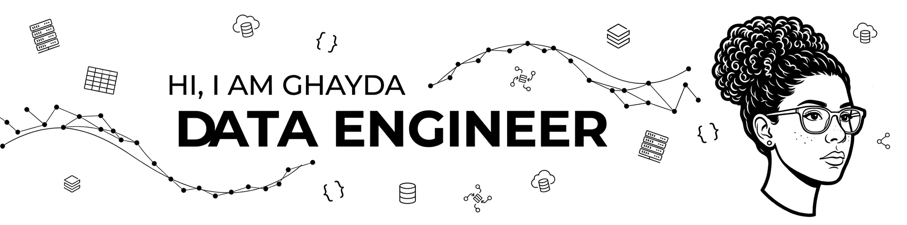

  

# HI, I'm Ghayda 👋
**Data engineer** | **Software Engineering Student at ENSI**

## 💻 Tech Stack:

## 🚀 What I'm doing:
- Building scalable data pipelines and ETL processes using PySpark, Databricks, and Azure  
- Exploring new technologies and tools in the data engineering ecosystem  

